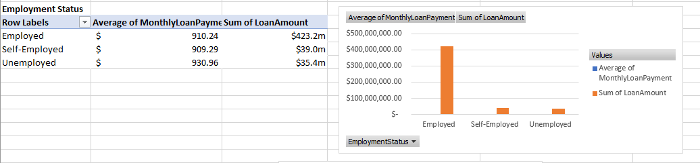

# Co-Operative Loan Report

## Table of contents

- [Project brief](#Projectbrief)
- [Objective](#Objective)
- [Key Questions to Answer](#KeyQuestionstoanswer)
- [Data source](#Datasource)
- [Tools](#Tools)
- [Dashboard design charts](#Dashboarddesignchart)
- [Stages](#Stages)
- [Data Cleaning Process](#Cleaning/Process)
- [Insights](#Insights)
- [Recommendations](#Recommendations)

## Project Brief: 
Cooperative Loan Analysis

## Objectives

The aim of this dataset is to provide detailed information on loan applications submitted to a co-operative financial institution. It includes applicant demographics, loan details, and approval status, allowing for a comprehensive analysis of trends, customer behavior, and business performance.

1.	Analyze Loan Applications Across Demographics: Examine how age, marital status, education, and employment status influence loan application volume and approval rates.
   
3.	Identify High-Value Customer Segments: Discover which groups (e.g. age, education level) are associated with higher loan amounts and better approval chances.
   
5.	Understand Monthly Loan Trends: Track loan funding performance across different months to identify peak and low-performing periods.
   
7.	Explore Loan Purpose Distribution: Determine the most common reasons customers request loans and analyze the funding associated with each category.
   
9.	Assess Loan Term Preferences: Review preferred repayment terms among applicants to help design better loan products.
    
11.	Support Data-Driven Decision Making: Provide actionable insights to help the organization optimize loan products, marketing efforts, and risk management.

## Key Questions to Answer

1.	In which months was loan funding highest and lowest?
  
2.	What is the total loan applications, funded amount and monthly payment.
   
3.	Is there a consistent trend in loan funding across the year?
   
4.	Are there any seasonal patterns in loan demand?
   
5.	Which age group submits the most loan applications?
   
6.	Which age group gets the most loan approvals?
    
7.	How does marital status affect the number of loan applications?
    
8.	Do younger applicants (under 30) get loans approved as often as older ones?
    
9.	Which education level accounts for the highest loan amount?
    
10.	Are loan applications correlated with the level of education?
    
11.	Which employment group (employed, self-employed, unemployed) requests the most loan funding?
    
12.	Is there a risk in the high loan volume from unemployed applicants?
    
## Data Source

## Tools 
| Excel | Cleaning, Processing, Pivot Tables |

## Dashboard Mockup
Process of which the dashboard was designed

## Stages

1. Get data from source
2. Load into Excel spreadsheet
3. Clean and Process using functions, formulas and Pivot tables.
4. Build Dynamic Dashboard using Charts

## Processing

## Insights

•	Age Group: Applicants aged 30–50 dominate loan applications and approvals.

•	Education Level: Individuals with Bachelor’s and Master’s degrees apply for the highest loan amounts.

•	Loan Approvals: Most approvals go to applicants between 30–50 years old.

•	Monthly Trend: Loan funding peaks around March, July, and September; dips in November.

•	Marital Status: Married individuals account for 50% of all applications.

•	Loan Purpose: Top purposes are auto, debt consolidation, and education.

•	Employment: Employed applicants request the highest amount, but unemployed applicants also request large sums.

•	Loan Term: Short- to mid-term loans (36–60 months) are most popular.

## Recommendations

•	Target Ages 30–50: Tailor marketing and loan products toward this active segment.

•	Promote Education Loans: Customize student or continuing education loan packages.

•	Review Unemployment Risk: High loan requests from unemployed applicants suggest a need for tighter screening.

•	Enhance Offers for Married Applicants: Introduce bundled financial services or loyalty programs.

•	Flexible Loan Terms: Focus offerings around the popular 36–60 month range.

•	Boost Low-Season Activity: Use promotions during lower loan activity months like November.
